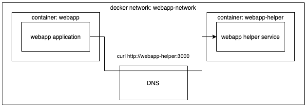

# Docker

**Docker** is a set of platform as a service (PaaS) products that use OS-level virtualization to deliver software in packages called containers.

**Containers** are packages of software that include the application and its dependencies. They are isolated environments in the host machine with the ability to interact with each other and the host machine itself via defined methods (TCP/UDP).

Virtual machines and containers solve different problems:

- **Virtual machines** (VM) run on a hypervisor (a type of computer software, firmware or hardware that creates and runs virtual machines), which virtualizes the physical hardware. Each VM includes a full operating system (OS) along with the necessary binaries and libraries, making them heavier and more resource-intensive.
- **Containers**, on the other hand, share the host OS kernel and only package the application and its dependencies, resulting in a more lightweight and efficient solution.

- **Virtual machines** provide strong isolation and are suited for running multiple OS environments, but they have a performance overhead and longer startup times.
- **Containers** offer faster startup, better resource utilization, and high portability across different environments, though their isolation is at the process level, which may not be as robust as that of VMs

Docker relies on Linux kernels, which means that macOS and Windows cannot run Docker natively without some additional steps. Each operating system has its own solution for running Docker. For example, Docker for Mac uses under the hood actually a virtual machine that runs a Linux instance, within which Docker operates.

An **image** is a blueprint with all the necessary instructions and dependencies needed to build a container. An image and a container runtime (Docker engine) is all you need to create a container. Thus, containers are instances of images.

## Docker CLI basics

We use the command line to interact with the _Docker engine_ that is made up of 3 parts:
 - command line interface (CLI) client
 - a REST API
 - Docker daemon
When you run a command, behind the scenes the CLI client sends a request through the REST API to the Docker daemon which takes care of images, containers and other resources. The most basic commands are: 

- docker **`pull`** <image>	: Fetches the given image from the Docker registry
- docker **`images`**		: Lists all images fetched to our system
- docker **`run`** <image>	: Runs a Docker container based on the provided image
- docker **`ps`**			: (**<ins>p</ins>**rocess **<ins>s</ins>**tatus) Shows all the containers that we have currently running 
- docker **`ps -a`**		: Shows all the containers that we have ran but are currently inactive
- docker <command> `--help`	: Displays help (basically available options) about provided command

---------------------------

## 1. Running a container

BusyBox is a tiny Linux distro that packages many common Unix utilities (`ls`, `sh`, `cat`, ...) into a single binary, resulting in a very small image (usually less than 1 Mb.)

First we are going to pull busybox image from Docker hub:

   &nbsp;&nbsp;&nbsp;&nbsp;&nbsp;`docker pull busybox`

Now we run a busybox container followed by a command:

   &nbsp;&nbsp;&nbsp;&nbsp;&nbsp;`docker run busybox ls -la`

We can give the container a name with the **<ins>--name</ins>** flag. If we don't specify any name, Docker will assign to our container a funny random one.

   &nbsp;&nbsp;&nbsp;&nbsp;&nbsp;`docker run --name < my_custom_container> busybox ls -la`

The Docker client[^1] finds the image, creates a command and runs the `ls -la` command in that container:

```bash
drwxr-xr-x    1 root     root          4096 Apr  9 16:22 .
drwxr-xr-x    1 root     root          4096 Apr  9 16:22 ..
-rwxr-xr-x    1 root     root             0 Apr  9 16:22 .dockerenv
drwxr-xr-x    2 root     root         12288 Sep 26  2024 bin
drwxr-xr-x    5 root     root           340 Apr  9 16:22 dev
drwxr-xr-x    1 root     root          4096 Apr  9 16:22 etc
drwxr-xr-x    2 nobody   nobody        4096 Sep 26  2024 home
drwxr-xr-x    2 root     root          4096 Sep 26  2024 lib
lrwxrwxrwx    1 root     root             3 Sep 26  2024 lib64 -> lib
dr-xr-xr-x  441 nobody   nobody           0 Apr  9 16:22 proc
drwx------    2 root     root          4096 Sep 26  2024 root
dr-xr-xr-x   13 nobody   nobody           0 Apr  9 16:22 sys
drwxrwxrwt    2 root     root          4096 Sep 26  2024 tmp
drwxr-xr-x    4 root     root          4096 Sep 26  2024 usr
drwxr-xr-x    4 root     root          4096 Sep 26  2024 var
```

The command is executed within the container, and the process stops. If we want to start an interactive session, the **`-it`** option allows to interact with the container via a shell:

   &nbsp;&nbsp;&nbsp;&nbsp;&nbsp;`docker run -it busybox sh`

- `-i` option (i stands for interactive) tells Docker to keep STDIN open on the container, allowing it to receive input like typed commands or piped data
- `-t` option (stands for teletype/terminal) allocates a pseudo-tty which gives you a terminal interface on your machine
	
> The `sh` command to start shell is not really necessary in this case, and an interactive shell will start even if we run the container without any command because `sh` is the default command defined in the BusyBox image. The image has something like `CMD[sh]` in its Dockerfile so whe you don't specify a command Docker falls back to that default, which happens to be the shell.
> Specifiying the command wuld matter using an image where the default command is not a shell, for instance
>   `docker run -it python sh`

To finish shell session, use the <ins>**`exit`**</ins> command.

If the image already exists in Docker registries, even if we haven't pulled it the image will be downloaded and installed automatically. 

By default, the image pulled is the `latest` version. If we want to download a different one, we must add its tag after the command (separated by a colon):

   &nbsp;&nbsp;&nbsp;&nbsp;&nbsp;`docker run -it wordpress:beta-6.8-php8.3`

Available versions can be checked at Docker registries (e.g. https://hub.docker.com/). In terminal, we can also run `docker search wordpress`

---------------------------

## 2. Container isolation. Restarting/executing containers.

<ins>**`docker ps -a`**</ins> displays a list of all the containers, even the stopped ones:

```bash
CONTAINER ID   IMAGE     COMMAND   CREATED          STATUS                      PORTS     NAMES
116268d6f047   alpine    "ash"     10 minutes ago   Exited (0) 9 minutes ago              reverent_volhard
a8ee7dd5130a   alpine    "sh"      12 minutes ago   Exited (0) 11 minutes ago             awesome_gauss
309a1b13c3bb   busybox   "sh"      13 minutes ago   Exited (0) 12 minutes ago             practical_elion
```

In the example we see that even though each `docker container run` command used the same alpine image, each execution was a separate, isolated container. Each container has a separate filesystem and runs in a different namespace; by default a container has no way of interacting with other containers, even those from the same image. Any change done within a container (e.g. creating a new file) will not affect the rest. This is a critical security concept in the world of Docker containers.

To restart a container session, we can use docker command <ins>**`start`**</ins>. However, running

   &nbsp;&nbsp;&nbsp;&nbsp;&nbsp;~~`docker start 116`~~

makes the container run in the underground quietly with no terminal attached, so we cannot interact with it. To do so, before starting the container we need to <ins>**`attach`**</ins> to it:

   &nbsp;&nbsp;&nbsp;&nbsp;&nbsp;`docker start 116268`\
   &nbsp;&nbsp;&nbsp;&nbsp;&nbsp;`docker attach 1162`

Or, alternatively, we can combine both commands in one go using `-a` (attach) and `-i` (interactively) options:

   &nbsp;&nbsp;&nbsp;&nbsp;&nbsp;`docker start -ai 116268d6f`

We can send a command in to the container to run by using the <ins>**`exec`**</ins> command:

   &nbsp;&nbsp;&nbsp;&nbsp;&nbsp;`docker exec <container_ID> ls -la`

This command can also be used as a third way to start an interactive session with a stopped container:

   &nbsp;&nbsp;&nbsp;&nbsp;&nbsp;`docker start 116268d6f047`\
   &nbsp;&nbsp;&nbsp;&nbsp;&nbsp;`docker exec -it 116268d6f047 sh`

---------------------------

## 3. Deleting containers

Leaving all those stray containers eat up disk space. To clean up once we have done with them, use the <ins>**`rm`**</ins> command:

   &nbsp;&nbsp;&nbsp;&nbsp;&nbsp;`docker rm <container ID>`

To delete a bunch of containers in one go:

   &nbsp;&nbsp;&nbsp;&nbsp;&nbsp;`docker rm $(docker ps -a -q -f status=exited)`

In later versions, `docker container prune` command does the same.

---------------------------

## 4. Creating and deleting images

We can pull an existing image, run it in a container and modify it as needed. E.g.:

```bash
docker container run -it ubuntu bash
apt-get update
apt-get install -y figlet
figlet "Hello!"
```

Our container installs the _figlet_ package and runs it, displaying 'Hello' in an ASCII-art way. If we want to share our new application, we must <ins>**`commit`**</ins> our changes:

   &nbsp;&nbsp;&nbsp;&nbsp;&nbsp;`docker container commit <container_ID>`

We can also <ins>**`tag`**</ins> our custom image so that it is easier to identify when we display a list of our system `images`:

   &nbsp;&nbsp;&nbsp;&nbsp;&nbsp;`docker image tag <container_ID> <my_image_name>`

In case we want to list the files that were added or changed to the original container, we can use the <ins>**`diff`**</ins> command:

   &nbsp;&nbsp;&nbsp;&nbsp;&nbsp;`docker container diff <container_ID>`

Now we can run a container based on our newly created _<my_image_name>_ image:

   &nbsp;&nbsp;&nbsp;&nbsp;&nbsp;`docker container run my_image_name figlet hello!`

If we don't need the image anymore, we can delete it from our system:

   &nbsp;&nbsp;&nbsp;&nbsp;&nbsp;`docker image rm my_image_name`

---

## 5. Creating our images using a Dockerfile

What we have just created is a static binary image, that is, a file system with the modified files, executables and configs. These are "raw binary files" in the sense that it’s just the built, saved state of the container at that moment.
- This image can be run but you don't know how it was built.
- You can't easily reproduce, modify or update its content unless you reverse-engineer it.

A Dockerfile supplies the instructions for building the image, rather than just the raw binary files. This is useful because it becomes much easier to manage changes, especially as your images get bigger and more complex. It's kind of a Makefile, where you supply the instructions for building the executable, instead of just providing the binary file.

Let's create a Dockerfile to build our own 'hello world' application in bash. This is the script we are going to run, _hello.sh_:

```bash
#!/bin/sh 
echo "hello from $(hostname)"
```

To build our image, we will use alpine (an specific version, 3.21) as the base OS image, copy our source code -the script- into the container and specify the default command to be run upon container creation:

```bash
FROM alpine:3.21
WORKDIR usr/src/app
COPY hello.sh .
RUN chmod +x hello.sh
CMD ./hello.sh
```

> Should our script be written in bash (just change the _shebang_ to `#!/bin/bash`), Alpine would not be able to run it because it does not include by default. In this case, we would have to add a line to our Dockerfile:\
> &nbsp;&nbsp;&nbsp;&nbsp;&nbsp;`RUN apk update && apk add bash`\
> to install Bash.

> [!NOTE]
> To pass an argument to command: `CMD["executable", "argument"]`\
> To wait for argument after execution: `ENTRYPOINT["executable"]`

To <ins>**build**</ins> the image:

   &nbsp;&nbsp;&nbsp;&nbsp;&nbsp;`docker image build . -t hello:bash .`

And to run it:

   &nbsp;&nbsp;&nbsp;&nbsp;&nbsp;`docker container run hello:bash`

Finally, this is our output:

   &nbsp;&nbsp;&nbsp;&nbsp;&nbsp;hello from b1ebb08fb32e

> [!NOTE]
> When writing a Dockerfile we should always try to keep the most prone-to-change rows at the bottom, to preserve as much cached-layers as possible and speed up the build process (read more about Docker build cache [here](https://docs.docker.com/build/cache/))

---------------------------

## 6. Mounts: Sharing and keeping persistent data

Containers are ephemeral, their data vanishes when they're removed. If you want to persist data, or share files between your host and the container, you need **mounts**.

Mounts are a way to manage and store data separately from the containers themselves. They provide a means to store and share files and directories that can persist during the container's lifetime.

Furthermore, mounts enable data sharing among multiple containers. For instance, you can create a mount and attach it to different containers running different services, allowing them to access and manipulate the shared data. This promotes modularity and flexibility in your Docker setup.

Docker has three main types of mounts:
 - **Bind mounts**
 - **Volumes**
 - **Tmpfs**

### 6.1 Bind Mount: You pick the folder

By default host directories are not available in the container file system , but with **bind mounts** we can expose and access them. Bind mount makes a path in the container point directly to a path on the host — replacing anything that was originally at that container path. **It is a way to override a file or directory inside the container with one from the host system**. Rather than harmlessly _linking_ two paths, it is indeed a **one-way takeover** of the container path.

> [!Warning]
> When you mount a host path into a container, the original contents of that container path are hidden. This can be powerful for development or saving logs, but you must be careful not to mount over paths that the container depends on to run, like startup scripts or binaries.

Usage in Docker CLI:

   &nbsp;&nbsp;&nbsp;&nbsp;&nbsp;`docker run -v /host/path:/path/in/container image:tag`

Example:

   &nbsp;&nbsp;&nbsp;&nbsp;&nbsp;`docker run -v /home/carlos/dev:/app ubuntu:24.04`

This maps the local folder `/home/carlos/dev` into the container at `/app`.

- You can easily update the files on the host and see the changes immediately in the container.
- No need to rebuild the container to test code changes

Bind mounts tightly couple the container to the host machine’s filesystem, which means that processes running in a container can modify the host filesystem. This includes creating, modifying, or deleting system files or directories. Therefore, _it is crucial to be cautious with permissions and ensure proper access controls to prevent any security risks or conflicts_.

Bind mounts are not directly managed by Docker, they rely on a host folder structure.

When to use bind mounts:
- Development environments (live code changes on host appear immediately in the container)
- Need host-specific access and loading resources that may not be accessible from within the container such as devices or system files

### 6.2 Volume mount: Docker-managed storage

**Volume mounts** are like bind mounts but they are fully managed by docker itself. Volumes are stored in the Linux Virtual Machine rather than the host. 

Usage in Docker CLI:

   &nbsp;&nbsp;&nbsp;&nbsp;&nbsp;`docker run -v myvolume:/path/in/container image:tag`

Example:

   &nbsp;&nbsp;&nbsp;&nbsp;&nbsp;`docker run -v myvolume:/app/data ubuntu:24.04`

will mount Docker-managed volume `myvolume` to `/app/data` inside the container.

Benefits of Volume mounts:

- Better Performance due to their utilization of optimized drivers and file systems.
- Managed by Docker and can be easily backed up, restored, or migrated between different Docker installations.
- better portability and cross-platform compatibility

When to use Volume mounts:

- Persisting Database Data
- Handling File Uploads and Downloads
- Storing log files
- Changing or Applying New Configuration Files
- Backup and Restore

### 6.3 tmpfs: Fast but volatile

**tmpfs** (_Temporary File System_) is a Linux kernel feature, a type of filesystem that resides entirely in volatile memory (RAM), not on disk. Consequently,
- While Docker triggers the creation of the tmpfs mount, the actual memory management is done by the host kernel.
- When the container stops or is recreated, the data vanishes. That makes it ideal for:
	- Sensitive data (like credentials or session keys)
	- Scratch space (intermediate calculations, temp files)
	- High-speed operations (RAM is faster than disk)

--tmpfs doesn't take a host path or volume name — it just tells Docker: “Mount a RAM-backed filesystem at this path inside the container.”:

   &nbsp;&nbsp;&nbsp;&nbsp;&nbsp;`docker run --tmpfs /path/in/container image:tag`

You can even specify size and mount options if needed:

   &nbsp;&nbsp;&nbsp;&nbsp;&nbsp;`docker run --tmpfs /path/in/container:rw,size=64m image:tag`

### 7.4 Docker commands for managing mounts

```bash
//Inspecting Mounts used in a container
docker inspect [container_id] --format='{{ .Mounts }}'

//Creating volumes
docker volume create [volume-name]

//Inspect info about volume
docker volume inspect [volume-name]

//Remove volume
docker volume rm [volume-name]
```
---

## 7. Ports: networking/communication

We can use ports to communicate with a containerized application, mapping your host machine port to a container port.

Opening a connection from the outside world to a Docker container happens in two steps:
- Exposing port
- Publishing port

Exposing a container port means telling Docker that the container listens to a certain port. This does not do much except helping humans with the configuration.

Publishing a port means that Docker will map host ports to the container port.

- To expose a port, add the line `EXPOSE <port>` in the Dockerfile
- To publish a port, run the container with `-p <host_port>:<container_port>

Usage:

   &nbsp;&nbsp;&nbsp;&nbsp;&nbsp;`docker run -p <host_port>:<container_port> some-image`

Example:

   &nbsp;&nbsp;&nbsp;&nbsp;&nbsp;`docker run -p 1000:2000 devopsdockeruh/simple-web-service`

Here’s what happens:
- Host is listening on port 1000.
- Docker’s networking layer is watching that port.
- When a connection comes in on host:1000, Docker intercepts it and forwards it to the container’s port 2000.
Host just listens, it's Docker who handles the forwarding.

Example:

   &nbsp;&nbsp;&nbsp;&nbsp;&nbsp;`docker run -p 8080:80 nginx`

- The container is running a web server on port 80.
- You access it from your browser via http://localhost:8080.
- The traffic is forwarded from your host's port 8080 to container's port 80.

If you leave out the host port and only specify the container port, Docker will automatically choose a free port as the host port:

   &nbsp;&nbsp;&nbsp;&nbsp;&nbsp;`docker run -p 4567 app-in-port`

We could also limit connections to a certain protocol only, e.g. UDP by adding the protocol at the end: `EXPOSE <port>/udp` and `-p <host-port>:<container-port>/udp`.   

> [!CAUTION]
> Since we are opening a port to the application, anyone from the internet could come in and access what we are running.
> A way for an attacker to get in is by exploiting a port we opened to an insecure server. An easy way to avoid this is by defining the host-side port like this `-p 127.0.0.1:3456:3000`. This will only allow requests from our computer through port 3456 to the application port 3000, with no outside access allowed.
> The short syntax, `-p 3456:3000`, will result in the same as `-p 0.0.0.0:3456:3000`, which truly is opening the port to everyone.
> Usually, this isn't risky. But depending on the application, it is something we should consider.

---

## 8. Docker Compose

Docker Compose is a tool designed to simplify running multi-container applications using a single command:

   &nbsp;&nbsp;&nbsp;&nbsp;&nbsp;`docker compose [-f <arg>...] [options] [COMMAND] [ARGS...]`

Example:

Assume we are in the folder where we have our Dockerfile with the following content:

```bash
FROM ubuntu:24.04
WORKDIR /mydir
RUN apt-get update && apt-get install -y curl python3
RUN curl -L https://github.com/yt-dlp/yt-dlp/releases/latest/download/yt-dlp -o /usr/local/bin/yt-dlp
RUN chmod a+x /usr/local/bin/yt-dlp
ENTRYPOINT ["/usr/local/bin/yt-dlp"]
```

Let us now create a file called `docker-compose.yml`:

```bash
services:
  yt-dlp-ubuntu:
    image: <username>/<repositoryname>
    build: .
```

The file defines:
- One service with name `yt-dlp-ubuntu`
- The name the new image is going to be tagged with
- The key `build` can be a file system path (in the example it is the current directory .) or an object with sub-keys `context` and `dockerfile` (see [documentation](https://docs.docker.com/reference/compose-file/build/))

It is pretty common that we use some readily built images, and in that case, the key `build` is not needed. For instance,

```bash
services:
  nginx:
    image: nginx:1.27
  database:
    image: postgres:17
```

> Proper naming:
> > services:  #**top-level key**\
> >    nginx:  #**user-defined identifier**\
> >       image: nginx:1.27 #**Docker object** (_image_) **name** (_nginx_) and **tag** (_1.27_)

## 8.1 Volumes in Docker Compose

**Volumes** in Docker compose are defined with the following syntax:

   &nbsp;&nbsp;&nbsp;&nbsp;&nbsp;`location-in-host:location-in-container`

Example:

```bash
services:
  yt-dlp-ubuntu:
    image: <username>/<repositoryname>
    build: .
    volumes:
      - .:/mydir
    container_name: yt-dlp
```

In this case, the **bind mount** is telling Docker to _take the current directory on the host (.), and mount it inside the container at /mydir_.

## 8.2 Key Commands in Docker Compose

- `docker compose up`	: Starts all services defined in the Docker compose file
- `docker compose down`	: Stops and removes the running services
- `docker compose logs`	: View the logs to monitor the output of the running containers and debug issues
- `docker compose ps`	: Lists all the services along with their current status

---

## 8.3 Binding ports in Docker Compose

The following example builds a image from 'jwilder/whoami', a simple service that prints the current container id (hostname):

```bash
services:
  whoami:
    image: jwilder/whoami
	build: .
    ports:
      - 8000:8000
```
Testing it with either:

   &nbsp;&nbsp;&nbsp;&nbsp;&nbsp;`docker compose up -d` \
   &nbsp;&nbsp;&nbsp;&nbsp;&nbsp;`curl localhost:8000`

the output confirms that we have just binded host port 8000 to container port 8000, so the container is reachable via the host’s port 8000

---

## 9.Setting environment variables within container's environment

When a container is created it has some environment variables by default, but only the ones set by Docker or defined in the image itself, not your custom ones. Let's run a basic container:

   &nbsp;&nbsp;&nbsp;&nbsp;&nbsp;`docker run -it ubuntu printenv`

The `printenv` command displays the bare minimum environment set by Docker and the base image:

```bash
PATH=/usr/local/sbin:/usr/local/bin:/usr/sbin:/usr/bin:/sbin:/bin
HOSTNAME=ff9bb901f76e
TERM=xterm
HOME=/root
```

Now let's run the container without any command:

   &nbsp;&nbsp;&nbsp;&nbsp;&nbsp;`docker run -it ubuntu`

Docker starts a container and, since we gave no command, runs the default command, which for Ubuntu is `/bin/bash`, an actual shell. That shell reads initialization scripts (like `/etc/profile`, `.bashrc`, etc, depending on the shell and image), and these scripts often set environment variables like `PWD`, `LS_COLORS`, `SHLVL`, `_`. **In any case, none of our custom environment variables is going to be set**.

1. To <ins>**set**</ins> a custom variable:

	- straight from shell to the container:

   &nbsp;&nbsp;&nbsp;&nbsp;&nbsp;`docker run -e VARIABLE=value image-name`

	- from docker compose, using the **environment** attribute:

		```bash
		services:
			myapp:
				image: myapp-image
				environment:
					- DEBUG=true
		```
		It can also be written with a `key-value map` style:

		```bash
		environment:
			DEBUG: "true"
		```

2. To <ins>**pass**</ins> an existing custom variable:

	- straight from shell to the container:

   &nbsp;&nbsp;&nbsp;&nbsp;&nbsp;`docker run -e VARIABLE image-name`

	- from docker compose, using the **environment** attribute:

		```bash
		services:
			myapp:
				image: myapp-image
				environment:
					- DEBUG
		```
	   The value of VARIABLE in the container is taken from the value for the same variable in the shell in which Compose is run or from the environment files

A container's environment can also be set using `.env` files along with the `env_file` attribute:

	- from the command line:

   &nbsp;&nbsp;&nbsp;&nbsp;&nbsp;`docker run --env-file myapp.env image-name`

	- from docker compose:

		```bash
		services:
			myapp:
				image: myapp-image
				env_file: "myapp.env"
		```

---

## 10. Docker networking

Connecting two services such as a server and its database in Docker can be achieved with a [Docker network](https://docs.docker.com/engine/network/). In addition to starting services listed in _docker-compose.yml_ Docker Compose automatically creates and joins both containers into a network with a [DNS](https://docs.docker.com/engine/network/#dns-services). Each service is named after the name given in the _docker-compose.yml file_. As such, containers can reference each other simply with their service names, which is different from the container name.

<p align="center">
	
</p>

In the picture we have two services running in a single network: webapp and webapp-helper. The webapp-helper has a server, listening for requests in port 3000, that webapp wants to access. Because they were defined in the same _docker-compose.yml_ file, the access is trivial. Docker Compose has already taken care of creating a network and webapp can simply send a request to webapp-helper:3000, the internal DNS will translate that to the correct access and ports do not have to be published outside of the network.

### 10.1 Manual network definition

In any case, it is also possible to define the network manually in a Docker Compose file. This makes it easy to set up a configuration where containers defined in two different Docker Compose files share a network and can easily interact with each other

A network is defined in _docker-compose.yml_ file as follows:

```bash
services:				# Top-level key
  db:					# User-defined service identifier (we name this!)
    image: postgres:13.2-alpine	# Docker image (name:tag)
    networks:				# Key inside the 'db' service config
      - database-network 		# Reference to a user-defined network

networks:				# Top-level key
  database-network: 			# User-defined network identifier
    name: database-network 		# Actual Docker network name (explicitly defined)
```

- The _top-level key_ **networks** at the end defines the network
- Each service 


[^1]: The *Docker client* is the command line tool that allows the user to interact with the *Docker daemon*[^2]

[^2]: The *Docker daemon* is the background service running on the host that manages building, running and distributing Docker containers.